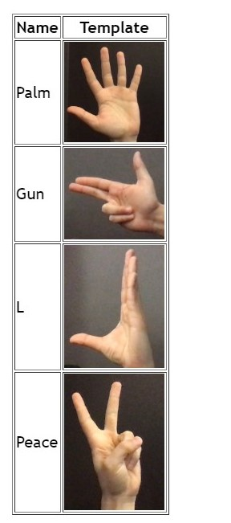
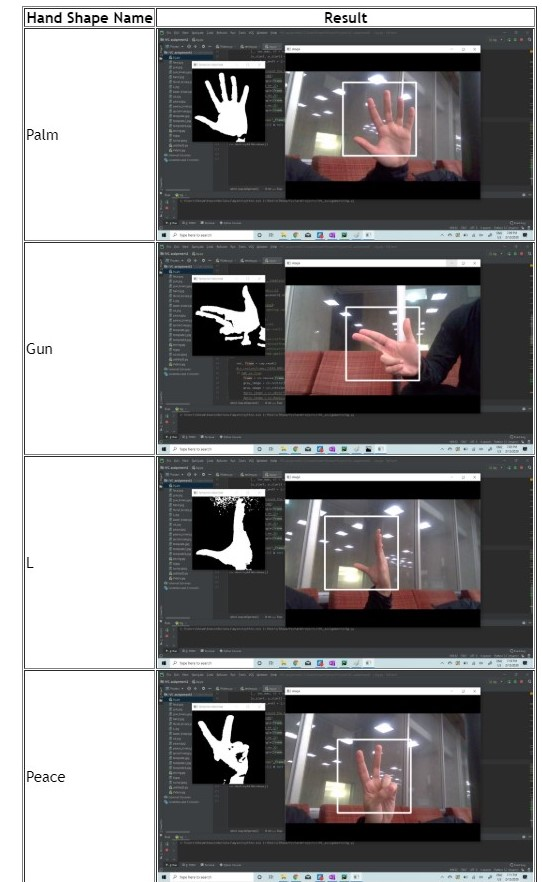

# Template-Matching-Using-Cross-Correlation

 

## Objective

Using Template Matching and other basic computer vision techiniques to build a program using OpenCV that can recongnize 4 different hand shapes in real-time.

## Method and Implementation
**Steps:**

1. To make image invariant to background noise, used subtraction making first frame as background and subsequently subtracting next incoming frames.
1. Converted image in gray scale and after that ran experiments on different range values to detect the pixel value of skin color.
1. Used thresholding to binarize the image for detected skin pixels.
1. Same sets of transformations are incorporated to the template image as well.
1. Scaled the template image through a range of scaling factors and compared it with the source frame.
1. The template with the highest NCC with the scene is reported.

Following OpenCV methods were used:

  * minMaxLoc: to find the maximum value (and its index)of a matrix
  * threshold: to binarize an image with a given threshold
  * rectangle, putText: to draw bounding box over the detected gesture
  * matchTemplate: to calculate the cross-correlation of two images
 
## Experiments
These are the four different templates used:

## Results
Here are several recognition results of all four hand shapes:

The following confusion matrix was obtained by changing the hand gestures

| **Hand Shape** | **Palm** | **Gun** | **L** | **Peace** | 
| :---         |     :---:      |        :---:  |  :---: |  :---: |
| **Palm**   | 8     | 0    | 0 |2
| **Gun**     | 0       | 5      | 0 | 0 |
| **L**     | 0       | 2      | 5 | 1|
| **Peace**     | 2| 0       | 1 | 5 |

